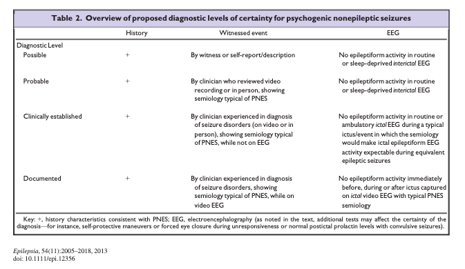
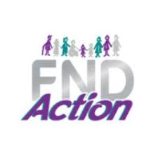
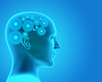
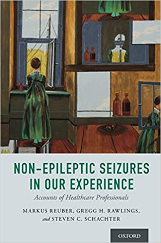

class: inverse, left,
background-image: url(https://images.unsplash.com/photo-1607688387751-c1e95ae09a42?ixid=MnwxMjA3fDB8MHxzZWFyY2h8ODF8fGJyYWlufGVufDB8fDB8fA%3D%3D&ixlib=rb-1.2.1&auto=format&fit=crop&w=500&q=60)
background-size: contain
background-position: right

```{r include=FALSE}
options(htmltools.dir.version = FALSE)

library(xaringan)
library(xaringanExtra)
library(dplyr)
library(gganimate)
library(ggExtra)
library(xaringanthemer)
library(RColorBrewer)
library(vembedr)
library(tweetrmd)

xaringanExtra::use_editable()
xaringanExtra::use_panelset()
xaringanExtra::use_freezeframe()
xaringanExtra::use_webcam()
xaringanExtra::use_fit_screen()
xaringanExtra::use_progress_bar(color = "red", location = "top")
xaringanExtra::use_tile_view()
xaringanExtra::use_scribble()
xaringanExtra::use_share_again()
```


.left[
# Functional Seizures & Other Functional Neurological Disorders
]

.pull-left[
.center[.large[
An introduction to working with functional seizures and other functional neurological presentations

*for:*

**Edgehill University**
]

https://fnd-for-paramedics.netlify.app]
          ]
          


---
class: inverse, center, middle

.pull-left[

## Chris Gaskell

### Clinical Psychologist

.fade[Salford Royal NHS Foundation Trust]

[`r icons::icon_style(icons::fontawesome("twitter"), scale = 1.5)` ](https://twitter.com/chrisgaskell92)
[`r icons::icon_style(icons::fontawesome("github"), scale = 1.5)`](https://github.com/chris-gaskell)
[`r icons::icon_style(icons::fontawesome("envelope"), scale = 1.5)`](mailto:cgaskell1@sheffield.ac.uk)
[`r icons::icon_style(icons::fontawesome("graduation-cap"), scale = 1.5)`](https://scholar.google.com/citations?user=gQuNwfYAAAAJ&hl=en&authuser=1&oi=ao)
[`r icons::icon_style(icons::fontawesome("researchgate"), scale = 1.5)`](https://www.researchgate.net/profile/Chris-Gaskell-2)
]

.pull-right[

## Gregg Rawlings

### Clinical Psychologist

.fade[Nottingham Trent University]

[`r icons::icon_style(icons::fontawesome("envelope"), scale = 1.5)`](grawllings@sheffield.ac.uk)
[`r icons::icon_style(icons::fontawesome("researchgate"), scale = 1.5)`](https://www.researchgate.net/profile/Gregg-Rawlings-3)
]


---
class: top, left, inverse
background-image: url("https://images.unsplash.com/photo-1538166261293-9230c2a7ee36?ixid=MnwxMjA3fDB8MHxzZWFyY2h8MXx8d2FybmluZ3xlbnwwfHwwfHw%3D&ixlib=rb-1.2.1&auto=format&fit=crop&w=500&q=60")
background-position: 225% 60%
background-size: contain

# Disclaimers

--

`r icons::icon_style(icons::fontawesome("frown-open", style = "solid"), scale = 1.5, fill = "white")` .Large[Emotionally pertinent areas]

???
The content of what we are going to be discussing maybe distressful for some people here. We do not personally know what affiliations you have to this area so please feel free to look after yourself in anyway you need to.

--

`r icons::icon_style(icons::fontawesome("video", style = "solid"), scale = 1.5, fill = "white")` .Large[Potentially distressing videos]

???
I am going to be showing some videos of people experiencing functional symptoms and who are also experiencing acute distress, if anyone would sooner not watch these videos then you are welcome to turn off your screens while we are watching them. I'll give people a warning when there is going to be a video and then you can decide for yourself.

--

`r icons::icon_style(icons::fontawesome("hand-paper", style = "solid"), scale = 1.5, fill = "white")` .Large[Not about changing protocol]


???
We are not here to Change your acute management of this condition. Neither of us are medically trained, so we will not know how to respond to someone experiencing a seizure. Instead, what is teaching is far is to give you all some understanding of what the condition is, and to discuss some of the challenges of living with this condition.


---
name: contents-slide
class: top, left
background-image: url(files/img/make-plan.jpg)
background-position: 100% 50%
background-size: contain

# Contents

.pull-left[
.large[
[**What is NEAD and FND?**](#what-slide)

[**Why and What is Happening?**](#why-slide)

[**Therapeutic Approach**](#therapeutic-slide)

[**Case Examples**](#examples-slide)

[**Resources**](#resources-slide)
]

.footnote[.DarkBlue[**Note**:] Headings are internal links.]
]

.pull-right[
.footnote[
This presentation is also available as a
<a href="https://github.com/chris-gaskell/fnd-for-paramedics/blob/main/output/index.pdf">pdf</a> `r icons::icon_style(icons::fontawesome("file-pdf", style = "solid"), scale = 1.5, fill = "black")`
]]

---
name: what-slide
class: top, center
background-image: url(https://images.unsplash.com/photo-1579099715183-a057711f3aa6?ixid=MnwxMjA3fDB8MHxzZWFyY2h8Mnx8d2hhdHxlbnwwfHwwfHw%3D&ixlib=rb-1.2.1&auto=format&fit=crop&w=500&q=60)
background-position:100% 60%
background-size: .3

# So What is This All About?

--

.left[
.large[**FND** = Functional Neurological Disorder

**NEAD** = Non Epileptic Attack Disorder
]]

--

.pull-left[
`r embed_youtube("Dy3XLo7dVQI", width = 500, height = 300) %>% use_start_time("1m00s")`
Video by Massachussets General Hospital
]
---

# Definitions: FND

- .blue[Functional Neurological Symptoms Disorder] was added as an inclusion term to Conversion Disorder in the DSM-5, which was published in May of 2013.
- A patient can be diagnosed with FND if they have motor and/or sensory findings providing:
  - “evidence of incompatibility between the symptom and recognized neurological or medical conditions” (American Psychiatric Association, 2013, Stone et al., 2010b).
- The symptom must impair social and/or occupational functioning or lead individuals to seek a medical opinion. There are no duration or severity criteria or explicit rules for exclusion based on additional symptoms.

- .blue[Dissociative Neurological Symptom Disorder] the most recent term used in the ICD-11 (World Health Organization International Coding manual) despite pushback from FND Hope and leading FND specialists around the world.

???
The term functional has been used to describe symptoms which impacts upon neurological function but which do not have the same underlying pathological abnormality.

---
class: top, left
background-image: url(files/img/survey-co-occurance.png), url(files/img/survey-vas.png)
background-position:100% 100%, 0% 50%
background-size: 60% 100%, 40% 65%


# Symptoms of FND

.footnote[
.small[
<a href="https://onlinelibrary.wiley.com/doi/abs/10.1111/ene.15018?casa_token=2uCYK3ti2IMAAAAA:scIHpsYzg1-fU-YKXrGNfEOeq6oNNk_ILusUvSlaCCI2KwYUCXa2B19jwp-MNM4B23U7b2ECC7lQ7Rs">Butler et al (2021)</a> survey of 1048 individuals living with FND.
]]

???
These visualisations come from a recent survey of people living with FND.

This is the largest survey of this kind. As you can see on the right hand side from the symptom cooccurrence network there is a high comorbidity of various forms of symptoms with FND.

Quite concerning are the rates of co-occurance with other symptoms which are not core FND symptoms, for example 93% of people with FND also experience fatigue.

From the visual analog clock on the left you can see the responses to a range of questions from people living with FND. Quite interesting is the response to the question "Cause a combination of physical/stress", is very high. This is a little insight as to what people with FND believe the cause of it to be, and based on this it is both physical and stress related.

---
class: top, left
background-image: url(files/img/neurosymptoms-types.png)
background-position: 100% 50%
background-size: contain


.left-column[
# Types of FND

.small[
Classified by <a href="https://www.neurosymptoms.org/en_GB/symptoms/">neurosymptoms.org</a>, extracted  2021
]]

???
FND takes many shapes and forms. The symptoms that one person experiences for FND may look very different to another persons experiences. This is what we call heterogeneity.As the constellation of symptoms that individuals experience can be so different, it is inherently difficult to classify subtypes. What we can do however is group the types of symptoms that people tend to experience. This grid is based on the euro symptoms website which is a fantastic resource. For each of these categories of symptoms there is a attached information sheet for patients and professionals to download.

Working in and then EAD service, the people that I see all experience some form of functional seizure. Despite this, the vast majority of patients will also experience another form of functional symptom.

---
# Definitions: Non-epileptic seizures

- One manifestation or constellation of FND.
- In DSM-5, psychogenic nonepileptic seizures are classified as a form of conversion disorder, or functional neurological symptom disorder, with the term "functional" referring to an impairment of normal bodily functioning.
- Disruption of usually integrated functions of consciousness, memory, id, or perception (amnesia, fugue, dissociative id disorder, depersonalisation disorder) (Goldstein et al, 2000)

--

People with NEAD experience **episodes of temporary loss of control and/ or awareness**

```{r warning=FALSE, echo = FALSE, eval=TRUE}
# Data for Table
    SympomDomains <- c("Movement",    "Senses",      "Awareness & thinking skills")
    Examples <- c("Shaking; Difficulty controlling movement; Falls",
                  "Challenging to senses, Feeling numb",     " Feeling confused; Distant; Disorientated; Blacking out")
    SummaryTable <- data.frame(SympomDomains, Examples)
# Table
 kableExtra::kable(SummaryTable, booktabs = TRUE, escape = FALSE, longtable = FALSE, align = "l",
          caption = "Impact of NEAD.") %>%
          kableExtra::row_spec(row = 0, align = "c") %>% kableExtra::kable_styling(full_width = FALSE, latex_options = "striped")
```

???
As you can see in the table, these are some of the differences between functional seizures and epileptic seizures.

---
background-image: url(files/img/tloc-esc.png)
background-position: 100% 50%
background-size: contain

.footnote[
Taken from: <a href="https://www.researchgate.net/publication/323856711_2018_ESC_Guidelines_for_the_diagnosis_and_management_of_syncope">ESC Guidelines for the diagnosis and management of syncope, 2018</a>]

???
This is a diagram from the… When thinking about non-epileptic or functional seizures we are often referring to people experiencing a temporary loss of consciousness. Most pacifically on this diagram we are thinking about the psychodynamic causes of transient loss of consciousness.

---
class: top, left

# Inter and Intra-variability

- Different people experience different symptoms (as illustrated in the co-occurance network in a previous slide).
- Symptoms of non-epileptic attacks are not always the same.
- Symptoms change over time
  - For example, some patients with functional seizures may initially experience  panic attacks, but over time, symptoms of anxiety may diminish and manifesta- tions of dissociation increase (Goldstein and Mellers, 2006).

.Large[.red[Gregg do you have any further info/papers?]]

???
As mentioned before the symptoms of non-epileptic attacks or other forms of functional disorder can look very different from one person to the next.In addition, the nature of symptoms can change dramatically for each person over time.For example so I may start off with one dominant form of symptom, but overtime over symptoms become more or less apparent. One person that I am working with currently, when he will affect the service his dominant symptom was functional seizures. But by the time his appointment came round he had developed a functional speech disorder. This caused him to hijacking in his neck and increased effort to speak.

---
exclude: true
class: top, left

# Epilepsy vs. NEAD
### What's the difference?

```{r warning=FALSE, echo = FALSE, eval=TRUE}
# Data for Table
    NEAD <- c("No abnormal electrical disicharge",    "Of psychological origin",      "No need for anti-epileptic drug treatments",      "Abnormal EEG",      "Does not occur in sleep")
    Epilepsy <- c("Abnormal electrical disicharge",       "Of physical origin",     "Need for anti-epileptic drug treatments",     "Normal EEG",   "Can occur in sleep")
    SummaryTable <- data.frame(NEAD, Epilepsy)
# Table
 kableExtra::kable(SummaryTable, booktabs = TRUE, escape = FALSE, longtable = FALSE, align = "l",
          caption = "NEAD vs Epilepsy.") %>%
          kableExtra::row_spec(row = 0, align = "c") %>% kableExtra::kable_styling(full_width = FALSE, latex_options = "striped")
```

???
This is a really helpful tool it should be in provided by a recent academic publication.
It provides a summary of the evidence for various clinical signs in distinguishing between functional seizures and organic seizures.
Just a caveat, that we are not encouraging you to make a differential diagnosis or to change anything you would usually do in your acute management.


---
class: bottom, left
background-image: url(files/img/Stone-NEAD-Table.png)
background-position: 90% 50%
background-size: contain

.left-column[
# Signs of Non-epileptic Attacks

.small[Taken from: FND in the emergency department <a href="https://onlinelibrary.wiley.com/doi/full/10.1111/acem.14263">Finkelstein et al., 2021</a>]]


---
class: bottom, left
background-image: url(files/img/Stone-movement-table.png)
background-position: 90% 50%
background-size: contain

.left-column[
# Signs of Functional Weakness

.small[Taken from: FND in the emergency department <a href="https://onlinelibrary.wiley.com/doi/full/10.1111/acem.14263">Finkelstein et al., 2021</a>]]

---
class: top, centre

# How common is NEAD?

**Approximately:**

- 20,000 people in the UK have this diagnosis – but there are likely to be many more.
- 1 out of every 5 people referred to a first seizure clinic go on to have a diagnosis of NEAD.
- NEAD accounts for up to 50% of patients brought to hospital with suspected ‘status epilepticus’. Still likely to be an under estimate.

(Howell, Owen, Chadwick, 1989; Kotsoupoulos et al., 2003, Rawlings, Brown & Reuber, 2017)

A recent estimate of prevalence from Norway found prevalence to be 23.8 per 100,000<a href="https://onlinelibrary.wiley.com/doi/full/10.1111/epi.16949"> (Villagrán 2021) </a>

**Note:** It is hard to accurately quantify prevalence rates in non-epileptic attacks due to common diagnostic delay and patients being lost to follow-up.

???
- Because of the complexities around diagnosis, this 20,000 person estimate is likely to be a underestimation.
–

---
# Who is most likely to be affected?

1. **Age:**
Young people (15–19) may actually be more at risk and the point when onset is most likely. <a href="https://onlinelibrary.wiley.com/doi/full/10.1111/epi.16949">Villagrán (2021) </a> - 59.5 per 100,000.
1. **Gender** Gender disparities are far less evident in younger and older cohorts (e.g.,
<a href="https://jnnp.bmj.com/content/early/2021/08/16/jnnp-2021-326443.abstract">Jungilligens (2021) </a>
1. **Epilepsy:**
High rate of comorbidity.
1. **Psychiatric comorbdity**
  1. Anxiety and depression = 
  1. "Personality disorder" =
  1. PTSD
  1. Trauma

.Large[.red[Gregg you got any good references/statistics?]]

???
- Age: Generally consistent with Hansen 2020 pediatric paper which found that across pediatric populations incidence rates is highest in 16-17 years old. 
- Gender: Greater female preponderance in adolescence and adults however this seems to become less evident in older people.
- Trauma: Lots of people who have not experienced trauma.

---
class: top, left
# Diagnosis

.pull-left[
### How is it diagnosed?
Diagnosis usually by a Neurologist or Neuropsychiatrist based on:

- Clinical history
- Videos
- Objective signs
- Subjective experience
- EEG (electroencephalogram) 
- ECG (electrocardiogram)
- Videotelemetry
]

.pull-right[Journey to diagnosis can be
.red[very long].
Recent estimate of 3.2 years (although 48% in same year).



]

???
One of the key dilemmas facing this field is the obstacles to prompt and accurate diagnosis. Many professionals are simply unfamiliar with this condition, or maybe somewhat familiar but I'm confident to make accurate diagnosis.
What's more it is, or can be very difficult to distinguish between epilepsy and functional seizures, and therefore it may need the specialist investigation of a highly specialist neurologist.
May include the patient having to come to hospital for an inpatient admission so that they can be observed having seizures during the process known as video toiletry.
Because of these dilemmas in reaching a diagnosis it is unfortunately common for patients to go a number of years before receiving a diagnosis.


---

# Misdiagnosis & delayed diagnosis

Because NEAD can have clinical comparisons to epilepsy it can be difficult to distinguish one from the other.

This can lead to a variety of concerns around:
- Diagnostic delay.
- Response to status epilepticus.
- Prolonged use of anti-convulsants.
- Lack of access to neccersary support.

New paper demonstrating rates of people diagnosed and treated for status epilepticus who infact had non-epileptic attack <a href="https://jnnp.bmj.com/content/jnnp/early/2021/08/16/jnnp-2021-326443.full.pdf">(Jungilligens et al., 2021) </a>

???
Among 1210 patients diagnosed and treated as status epilepticus, 980 were aged eight years or older. Of these patients, 79 (8.1%) were discharged with a final diagnosis of pPNES. Of these, 55 (70%) were female and the mean age was 32.6 years (SD: 15.9 years), ranging from eight to 84 years.

---
class: top

# Not a New Condition

.left[
.pull-left[
Recognised as early as the <a href="https://psychiatryonline.org/doi/full/10.1176/appi.ajp-rj.2019.150111">18th Century</a>

Studied prominently after the First World War and the recognition of ‘shell shock’

Freud & Charcott
]]

.right[
.pull-right[
`r embed_youtube("IWHbF5jGJY0", width = 350, height = 500, allowfullscreen = TRUE) %>% use_start_time("0m00s")`
]
]

---
exclude: true
class: top, left, animated, fadeIn
background-image: url(https://i2.wp.com/mysocialmediamastery.com/wp-content/uploads/2020/06/WordsHavePower.jpg?resize=640%2C426)
background-position:
background-size: cover

---
class: top, left
background-image: url(files/img/WordsHavePower.jpg)
background-position: 85% 93%
background-size: 40% 30%


# Clearing up confusion

.pull-left-narrow[

Many terms used to describe the **same experience**.

.small[
- Non-epileptic attacks
- Psychogenic seizures
- Psychogenic non-epileptic seizures (PNES) 
- Dissociative seizures
- Conversion disorder
- Functional seizures
- Psychological seizures
- Pseudo-seizures]]

???
I think that many people who experience functional symptoms would feel the slide is really important. The language that gets used in referring to these experiences can be highly variable. As you can see on the slide there are a range of different terms which have all been used to describe a very similar experience or set of symptoms.
The problem is some of The terms you can see are far less favoured by the FND community, and rightly so. There are unfortunately a lot of unhelpful views, stigmatisation held towards people that have this condition. And therefore some of these terms may. Hold onto those pejorative views.
There is unfortunately no consensus as to which term is the best, almost accurate.

And this is a topic of high debate currently. Terms which are generally less helpful are pseudoseizures, psychological seizures and conversion disorder.

--

.pull-right-wide[
Some terms are more/less .red[**harmful**] than others.

Debate and lack of consensus regarding preferred term (see <a href="https://www.sciencedirect.com/science/article/pii/S1059131103000554">Stone et al., [2003]</a>,
<a href="https://www.seizure-journal.com/article/S1059-1311(19)30337-1/pdf">Barron [2019]</a>, FND Society [2020])., , and
<a href="https://www.ncbi.nlm.nih.gov/pmc/articles/PMC2906405/">La France [2010]</a>).

We refer to these events as.red[**“Episodes”**] (but are willing to be led by the individual) and our service uses .red[**Non-epileptic Attack Disorder (NEAD)**]].

---
class: top, left
background-image: url(files/img/terminology-preferences.png)
background-position: 102% 50%
background-size: contain


.left-column[
# What do patients prefer?

.small[<a href="https://onlinelibrary.wiley.com/doi/full/10.1111/acem.14263">Loewenberger, 2021</a>]]

???
This is a recent article of a UK service valuation exploring patient's preferred label.

---
class: top, left
background-image: url(files/img/preferences-rating.png)
background-position: 50% 50%
background-size: 

???
The bar chart that you can see shows the preference ratings of the commonly used terms in order to show rank. The terms are the score so a low preference rating is desirable and high preference rating is undesirable. As you can see hysteria pseudoseizures, Somatoform disorder are all less preferred. This is not surprising given the history of stigma and pejorative attitudes towards these terms.

---
class: top, left

# Not to be confused with

.Large[**Malingering:**]
- Deliberately manufacturing symptoms for material gain e.g. Money

.Large[**Factitious Disorder:**]
- Deliberately manufacturing symptoms for emotional gain e.g. Attention

.red[Do not mistake NEAD symptoms for factitious/malingering just because it doesn’t fit with what you know of epileptic seizures]

.red[Gregg paper on health professionals/neurologists perception of the role of alcohol.]

???
One of the few things which I really hope that people take away from this teaching is that the symptoms and experience of functional symptoms are not under the conscious control of volition of the person experiencing them.
This is really important because there is a history of people with FND not being believed or been described as "faking".
These two conditions are different from FND And do you have some level of conscious control. While I am sure that there are a number of people with functional symptoms which may in fact be lingering, I truly believe that this is a very very very small minority.

---

class: inverse

## Videos of FND and NEAs

.panelset[

.panel[.panel-name[NEA 1]
.center[
`r embed_youtube("MA1EYAg9y5k", width = 800, height = 450) %>% use_start_time("2m54s")`
]
] <!--CLip 1-->

.panel[.panel-name[NEA 2]
`r embed_youtube("MA1EYAg9y5k", width = 800, height = 450) %>% use_start_time("13m20s")`
] <!--Clip 2-->

.panel[.panel-name[NEA 3]
`r embed_youtube("MdOCo4hD4zI", width = 800, height = 450) %>% use_start_time("0m44s")`
] <!--Clip 3-->

.panel[.panel-name[NEA 4]
`r embed_youtube("MdOCo4hD4zI", width = 800, height = 450) %>% use_start_time("2m04s")`
] <!--Clip 4-->

.panel[.panel-name[NEA 5]
`r embed_youtube("i_1U9lNi314", width = 800, height = 450) %>% use_start_time("0m59s")`
] <!--Clip 5-->

.panel[.panel-name[NEA 6]
`r embed_youtube("8ODK1tQsxSE", width = 800, height = 550) %>% use_start_time("0m00s")`
] <!--Clip 6-->

.panel[.panel-name[NEA 7]
`r embed_youtube("6UkHFlZN3jg", width = 800, height = 550) %>% use_start_time("1m00s")`
] <!--Clip 7-->
]

???
Here are a series of videos of people experiencing functional seizures.

---
class: top, inverse
# NEAD service patients

CG to show video of NEAD service patients.

.Large[.orange[Gregg - Do you know any good videos of functional seizures or other functional presentations? Some of the ones on the previous slides aren't great.]]

???
Here is a video of a patient I am working with Who has kindly offered to let me show this video to you all.


---
name: why-slide
class: inverse, middle, center
# Why is it happening?

---
class: top, left
background-image: url(https://wexnermedical.osu.edu/-/media/images/wexnermedical/blog/2018-stories/12/watery-eyes/watery-eye_large.jpg?la=en&hash=44804C18C1D6E03DC44D5AD8B2C2CAA17EB3B37A), url(https://austinheart.com/util/images/blog/2019/2019-Aug-Blog--Woman-Clutching-Her-Chest-950x475.jpg)
background-position:95% 85%, 95% 45%
background-size: 300px 150px, 300px 150px


# The mind body link

Psychological experiences influence the body .red[.Large[**All The Time**]]

.pull-left[
- Sudden shock = heart beats faster
- Embarrassment = face goes red
- Upset = eyes produce tears

It is normal for changes to happen in the body
**without** a medical cause or disease
(e.g. tears when we feel sad are not caused by a disease; it is the mind-body link).
#### NEAD also happens through this Mind-Body link.
The cause is not medical but the impact on the body is .red[.bolder[REAL]].
]
.pull-right[


]

???
What we know about the mind and body are that they are, as I'm sure you already know, intrinsically related. How we think and feel can have a huge influence on our body and our visceral experience. On our very relatable set of examples, I'm sure people have had experience of shedding a tear and feeling really sad or heart rate increasing and feeling quite scared or shocked.
This relationship between the mind and body is in a small part A small illustration of what can happen in NEAD. In thinking about any ID and also in treating it we are constantly thinking about this mind body link.


---
class: top, left

# Influence of trauma

-  A traumatic event = an incident that causes physical, emotional or psychological harm.
-  Can be single event or many unpleasant/threatening incidents
-  Could be recent or a long time ago

**FACT:** It is common for people with NEAD to have experienced some form of trauma

**BUT**: Many people with NEAD have NOT experienced a trauma

Although many people with NEAD can identify things that have happened/ are happening in their lives that contribute to a build-up of stress, many people do not.

The reasons why an individual develops NEAD is not always obvious at first, because everyone’s lives are different.

???
Trauma is something that gets brought up a lot when discussing functional seizures. Trauma or a traumatic event is an event or incident which includes some form of harm either physical emotional or psychological. This might be a single isolated incident (example car crash). Or it might be a more cumulative effect of lots of little things that happen over time (Example bullying).
Lots of people with functional symptoms have experienced some form of trauma, however there are also a subset of patients who have not.
When there is no trauma present, it can leave conditions feeling a little confused as to why the functional symptoms have developed. For some people, there may have been some form of trauma but which can no longer be remembered or is not recognised as being traumatic. For example so I might have had a close family bereavement, and the individual with functional symptoms may feel that this was unrelated to the functional symptoms, however it might be that overtime this is related.

---
class: middle, left
background-image: url(files/img/trauma-models.png)
background-position: 115% 100%
background-size: contain


.left-column[

# Role of Trauma

.small[Taken from <a href="https://jnnp.bmj.com/content/90/7/813">Keynejad, 2021</a>]]

???

This is a framework of the different ways that people can experience trauma, and how that can have an impact upon whether or not a person develops functional symptoms.
Each of these four quadrants show different permutations of how functional seizures might develop.
In the top left quadrant you have a scenari whereby you might have a biological risk to developing this condition and then they were exposed to a moderate stressful event in childhood and then later in adult there was a moderate precipitating factor.

---
class: top, left
# What is happening during NEAD?

.pull-left[
- Fight/flight/freeze response - evolutionary based fear response that is adaptive for survival
- Freezing is one of the main defensive threat reactions across species
- (Roelofs, 2017; Rockliffe-Fidler & Mark Willis, 2018)

.center[

]]

.pull-right[
`r embed_youtube("lAtW7nJUcRA", width = 800, height = 400) %>% use_start_time("2m54s")`
]

---
class: top, left
# What can cause a person to go into/ stay in the amber zone?

1. Physical stress in the body (e.g., injury, illness, pain).
2. Difficult past experiences (e.g., situations that have felt threatening, loss of a loved one).
3. Current stressful situations (e.g., relating to finances, relationships, difficulty meeting responsibilities, loss of independence).
4. Emotional stress (e.g., worries about the future, difficult memories).

For many people, it is not one big thing that has caused them to go into and stay in the amber zone. It is often a combination of factors.

---
class: top, left
background-image: url(files/img/polyvagal.jpg)
background-position:
background-size: 95% 100%

---
class: top, left
background-image: url(files/img/green.png)
background-position: contain
background-size: 100% 100%

---
class: top, left
background-image: url(files/img/amber.png)
background-position: contain
background-size: 100% 100%

---
class: top, left
background-image: url(files/img/red.png)
background-position: contain
background-size: 100% 100%
---
class: inverse, middle, center
# Experience

---
class: top, left

# Triggers

.small[
A study(N = 100 patients) has shown considerable heterogeneity of triggers (Reuber et al., 2011).
- Small minority (10%) stated that they were “always” aware of triggers
- 57% were aware of triggers for some but not all
- 31% claimed never to be aware of triggers
- 43% of patients stated that their PNES “always” “come on out of the blue without warning,”;
- Witnesses questioned in the same study reported being aware of seizure triggers more often than patients them- selves (Reuber et al., 2011)
- Most commonly perceived triggers were:
  - Emotional states (50%: feeling stressed, upset, anxious, aroused, neglected, nonspecific unwell)
  - Bodily states (21%: illness, loss of sleep, feeling hot or cold, tiredness, pain, feeling dehydrated or exhausted after something energetic)
  - External stimuli (9%: crowded places, flashing lights, black and white patterns, blue light, flashing lights, smoke / flames / dogs / household objects acting as traumatic reminders, sun on surface, neon lights)]

.Large[.red[Gregg to add information?]]

---
class: top, left

# Warnings

The frequency with which prodromal or warning symptoms been self-reported in patient cohorts varies widely, between 24% and 92% (for review see Reuber & Rawlings)

People are at times more aware of the physical warning signs as opposed to the emotional warning signs.

"Willful submission" 
<a href = "https://jnnp.bmj.com/content/84/7/822.short?casa_token=sfClvFXXrjAAAAAA:bJvdFojchmiwqd82Tegqie4XnMndKlhs1_l1xAqwhSjmDaLNMCYAyMz1iVFIgqrW6dXODTAIvZU">(Stone & Carson, 2013)</a>. Although this does not mean the symptoms are intentional.

.Large[.red[Gregg to add information?]]

---
class: top, left

# Experiences during the seizure

- Tends to last longer than in epilepsy.
- One study found that generalized tonic-clonic seizures lasted 50–92 seconds, whereas PNES lasted 20–805 seconds; Many PNES went on for more than 2 minutes (Gates et al., 1985).
- PNES continuing for over 30 minutes (also called pseudostatus or PNES status) occur in about one-third of patientsm
- More than one-quarter of patients diagnosed with PNES at epilepsy centers have received intensive care treatment for presumed status epilepticus at least once (Reuber et al., 2003).

.Large[.red[Gregg to add information?]]

---
class: top, left

# The aftermath

- Patients often find it easier to feel the post-ictal symptoms.

.Large[.red[Gregg to add information?]]

---
class: top, left

# Journey to diagnosis

.Large[.red[Gregg to add information?]]

---
class: top, left

# What does NEAD feel like?

<figure class="quote">
  <blockquote>.blue[
  .large[
    “I feel like I am ‘tripping’ without taking nothing. I am in another world short term, and I feel confused, dazed, disorientated and its scary. My head and brain feels like a tin of broken biscuits. I am different and feel weird. Luckily these episodes don’t last long, but they happen ‘out of the blue’, when you least expect it!"]]
</figure>

<figure class="quote">
  <blockquote>.blue[
  .large[
  "Understanding of my environment is lost, and my body changes with my eyes spinning and poor-coordination and my listening is affected. I feel stupid during these episodes and I wonder do people notice or think I am acting or faking it for attention?”]]
  <figcaption>
    &mdash; People living with non-epileptic attacks</cite>  </figcaption>
</figure>
---
class: top, left

# What does NEAD feel like?

<figure class="quote">
  <blockquote>.blue[
  .large[
“I feel really spaced out. Like I’m not really there. I try to move but I am like a snail. I try to talk but it’s like my tongue is stuck”]]
</figure>
<figure class="quote">
  <blockquote>.blue[
  .large[
“I feel really spaced out. Like I’m not really there. I try to move but I am like a snail. I try to talk but it’s like my tongue is stuck”]]
</figure>
<figure class="quote">
  <blockquote>.blue[
  .large[
“I really can’t get up and cannot speak, if I kick out it is not because I am being aggressive, it’s because my body can help it”]]
  <figcaption>
    &mdash; People living with non-epileptic attacks</cite>  </figcaption>
</figure>


---
exclude: true
https://www.youtube.com/watch?v=olU3onRPqYs = really good video from MGH on patient journey of diagnosis and MDT treatment.

https://www.youtube.com/watch?v=bfLv5jMJlOw = history of FND 4:30-7:30. Also good general lecture of FND.

---
name: therapeutic-slide
class: inverse, middle, center
# Therapeutic Solutions

---
class: top, left
background-image: url(files/img/wristband.png), url(files/img/cards.png)
background-position:85% 85%, 85% 20%
background-size: 400px 250px, 400px 250px

# Is this NEAD?

.pull-left[
- Salford Royal NEAD service guidance letter
- Friends/ family members
- Salford Royal NEAD guidance cards
- Medical alert bracelets

Do not attempt to make a differential diagnosis. If information about the diagnosis is not available, follow epilepsy guidelines.
]


---
class: top, left
# Common concerns about NEAD

The changes that are experienced before, during and after episodes are caused by the fight/ flight/ freeze response

These changes might look and feel uncomfortable/ unpleasant but are not causing immediate harm:
- Brain activity remains the same

- Having an episode is not caused by and does not cause long-term internal damage.

---
class: top, left
# Common concerns about NEAD

**Risk of injury**
-  NEAD episodes do not cause internal damage
-  Risk of injury from falls during episodes is low
(number of injuries VS total number of episodes)

**Duration of episodes**
-  Episodes can last seconds, minutes, hours or even days.
-  Even if the episode lasts a long time (or longer than usual), it is
still not causing internal damage
-  The episode will pass naturally without need for medical
intervention

**Symptom variation**
-  Many people experience episodes that feel very different to one another
-  It is normal for episodes to change over time
---

class: top, left

.pull-left[
### .green[Do]
1. Maintain a calm, quiet environment
2. Give me space, speak to me calmly
3. Tell other people it is NOT a medical emergency
4. Help to re-orientate (e.g. tell the person where and who they are, what is happening).
5. Offer water.
6. Encourage noticing what they can see/hear (e.g. count the number of circles/ red things).
7. Maintain a calm environment.
8. Encourage focus on slow, deep breaths.
9. Find out if there is someone who can help them to get home/ to a safe place?
10. Provide support to friends/ family.
]
.pull-right[
### .red[Do not]
1. Give me medication
2. Touch me (unless to protect my head)
3. Crowd or stand over me
4. let there be more thn one person nearby
5. Try to bring me "out of it"
6. Restrain me
7. Time the episode
8. Take me to hospital, unless I have a significant injurt that needs immediate medical attention
9. try to lift the person up or try to get them moving before they are ready
10. Ask lots of questions

]
---
class: top, left
# How we talk about NEAD matters

.pull-left[
Communication has a significant impact on:

-  Patient satisfaction
-  Acceptance of the diagnosis
-  Frequency/ severity of symptoms
-  Future engagement with healthcare services

(Hall-Patch et al., 2010; McKenzie, Russell, Pelosi & Duncan, 2010)
]

.pull-right[
`r embed_youtube("MA1EYAg9y5k", width =500, height = 450) %>% use_start_time("1m00s")`
]

---

class: top, left
# How we talk about NEAD matters

.pull-left[
“We know your symptoms are real”

“We do not think your symptoms are “all in your head””

“We know that you are not pretending”

“We know that this is not your fault”

“NEAD is a well-recognised condition”

“It’s like having a software problem in your brain rather than a hardware problem”(Stone)"

“You are (just) stressed”
]

.pull-right[
“You do not have...”

“It’s nothing to worry about”

“You can control this”

“Stop doing this”
]

---
class: top, left
class: top, left
background-image: url(files/img/fnd-hope-stigma.jpg)
background-position: 95% 85%
background-size: contain

# Stigma


---
name: examples-slide
class: inverse, middle, center
# Case Vignettes

---

class: top, left

# Case Example 1

.Large[You are called to an incident in a shopping centre. The report is of someone experiencing a sudden collapse. You arrive to find a man, approximately 50 years old, on the floor making jerking movements with his arms and legs. His eyes are closed and he is not responding to your questions.]

.large[*Q: What are the standard assessments and interventions you would carry out in this situation?*
]
---
class: top, left

# Case Example 2

.Large[Whilst you are treating your patient, his care worker arrives. She lets you know that his name is Alan, he has a moderate learning disability, and has a NEAD diagnosis.

She tells you that he started to have NEAD episodes 3 years ago when he was living in an inpatient care facility. He was frequently restrained and sedated and did not understand why. His experiences were very distressing and, as a consequence, he now fears healthcare professionals.
]

.large[*Taking this information into consideration*:
1. *Q: How might you change your approach?*
2. *Q: What might you do the same?*
]

---
class: top, left

# Case Example 2 - "An Unhelpful Experience"

**What could be done differently:**
-  Don’t assume that I am drunk/ a druggie
-  Don’t assume that I am play acting for attention
-  Do treat me with compassion – I am a person who is not in control and feeling very scared
- Don’t tell me to get up, talk, stop burbling, telling me there’s no reason why I can’t talk
-  Understand that the episodes can come in waves and I, like many people, can be thrown back in to another episode one after another for several hours
-  Please offer me a drink with straw and then hold it – I am not able to move and, when episodes last for hours, can get pretty thirsty
-  Do provide reassurance
-  Do sit next to me, don’t stand over me

---
class: top, left

# Case Example 2 - "A Helpful Experience"

### The most helpful things that the paramedic team did:
-  They were calm
-  They took on board all the information they could find in my bag and the lanyard
-  They worked out that I could sometimes respond by nodding slightly and shaking head very slightly. They were quick to pick that up and the grunts I made! That made a massive difference.
-  When I was in the ambulance the paramedic asked me if I wanted the straps on me kept on. I still couldn’t talk or respond much but she seemed to understand that I could hear and understand. It was so helpful to keep the straps on because of my violent jerking. She was able to understand that I needed them staying.
-  I can’t remember if the paramedic asked me if I could hear her and understand her but I think she must have done.
-  Paramedics explained my diagnosis to staff at the emergency dept.

---
name: resources-slide
class: middle, center, inverse
# Resources

---
class: top, left

# .small[.center[Websites]]

.pull-left-narrow[
<p><a href="https://www.fndhope.org">

</a></p>
<p><a href="http://www.manchesterneurosciences.com/departments/neuropsychology/nead">

</a></p>
<p><a href="https://www.https://www.fndsociety.org/">

</a></p>

</body>
</html>
]

.pull-right-wide[
## FND Hope
- h
- j

## SRFT NEAD service
- 
- 

## FND Society
- 
- 
]

---
class: top, left

# .small[.center[Websites]]

.pull-left-narrow[
<p><a href="https://www.fndaction.org.uk/non-epileptic-attack-disorder/">

</a></p>
<p><a href="http://neurosymptoms.org/">

</a></p>
<p><a href="http://www.nonepilepticattacks.info/">

</a></p>

</body>
</html>
]

.pull-right-wide[
## FND Action
- 
- 

## Neuro symptoms
- 
- 

## Non-epileptic attacks
- 
- 
]


---
class: top, left

# .small[.center[Books]]

.pull-left-narrow[
<p><a href="https://www.amazon.co.uk/Non-Epileptic-Seizures-Our-Experience-Professionals/dp/0190927755">

</a></p>
<p><a href=https://www.amazon.co.uk/Our-Words-Personal-Non-Epileptic-Brainstorms/dp/0190622776">

</a></p>

</body>
</html>
]

.pull-right-wide[
## In Our Experiences
- 
- 
-

## In Our Words
- 
- 
-

]


---


# References
- Brown, R. J., & Reuber, M. (2016). Towards an integrative theory of psychogenic non-epileptic seizures (PNES). Clinical Psychology Review, 47, 55–70. doi: 10.1016/j.cpr.2016.06.003
- Hall-Patch, L., Brown, R., House, A., Howlett, S., Kemp, S., Lawton, G., Mayor, R., Smith P., & Reuber, M. (2010). Acceptability and effectiveness of a strategy for the communication of the diagnosis of psychogenic nonepileptic seizures. Epilepsia, 51(1), 70–78. doi: 10.1111/j.1528-1167.2009.02099.x
- Howell, S.J.L., Owen, K. & Chadwick, D.W. (1989). Pseudostatus Epilepticus. (1989). The Lancet, 334(8661), 485. doi: 10.1016/s0140-6736(89)92094-1
- Kotsopoulos, I. A., Krom, M. C. D., Kessels, F. G., Lodder, J., Troost, J., Twellaar, M., ... Knottnerus, A. J. (2003). The diagnosis of epileptic and non-epileptic seizures. Epilepsy Research, 57(1), 59–67. doi: 10.1016/j.eplepsyres.2003.10.014
- Mckenzie, P., Oto, M., Russell, A., Pelosi, A., & Duncan, R. (2009). Early outcomes and predictors in 260 patients with psychogenic nonepileptic attacks. Neurology, 74(1), 64–69. doi: 10.1212/wnl.0b013e3181c7da6a
- Porges, S. W. (2009). The polyvagal theory: New insights into adaptive reactions of the autonomic nervous system. Cleveland Clinic Journal of Medicine, 76(Suppl_2). doi: 10.3949/ccjm.76.s2.17

---

- Rawlings, G. H., Brown, I., & Reuber, M. (2017). Deconstructing stigma in psychogenic nonepileptic seizures: An exploratory study. Epilepsy & Behavior, 74, 167–172. doi: 10.1016/j.yebeh.2017.06.014
- Rockliffe-Fidler, C., & Willis, M. (2019). Explaining dissociative seizures: a neuropsychological perspective. Practical Neurology, 19(3), 259–263. doi: 10.1136/practneurol-2018-002100
- Roelofs, K. (2017). Freeze for action: neurobiological mechanisms in animal and human freezing. Philosophical Transactions of the Royal Society B: Biological Sciences, 372(1718), 20160206. doi: 10.1098/rstb.2016.0206
- Stone, J., Carson, A. & Hallett, M. (2016). Explanation as treatment for functional neurologic disorders. Handbook of clinical neurology, 139(3), 543-553.

---

```{r echo=F}
tweet_embed(tweet_url("chrisgaskell92", "1422124260844138501"), theme = "dark", maxwidth = 700)

```
---

class: inverse, middle, center
# Finished


